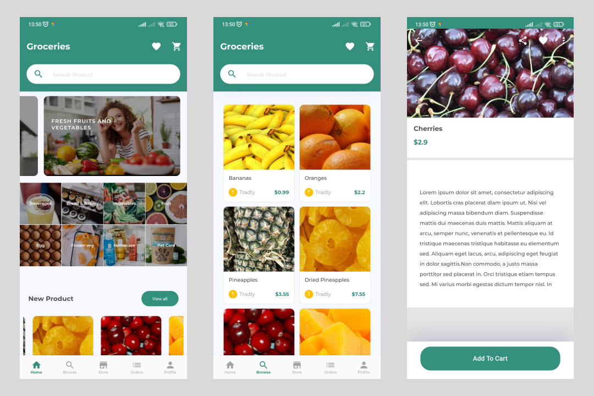

# Tradly App
## Sobre
Projeto criado com o intuito de exercitar meus conhecimentos em Flutter. 

Prints das telas

Algumas das funcionalidades / técnicas que usei foram:
- Criação de componentes (com e sem estado)
- Manipulação de estado do APP
- Roteamento
- Conexão com API REST
- Responsividade
- Utilização do componente 'Theme' da própria lib do Flutter 
- Utilização de fontes personalizadas
- Utilização de imagens externas (hospedadas online, fora do build do APP)
- Media Queries

## Download do APK
Caso queira testar o APP no seu dispositivo android você pode clicar no link abaixo para baixar o APK

Caso encontre alguma dificuldade para instalar o APK, separei [esse link](https://www.youtube.com/watch?v=b5D6zwkQKd4&ab_channel=Android4L) que pode lhe ajudar.

[APK Download](https://github.com/mateusisrael/tradly/raw/master/apk/tradly-app-release.apk)
